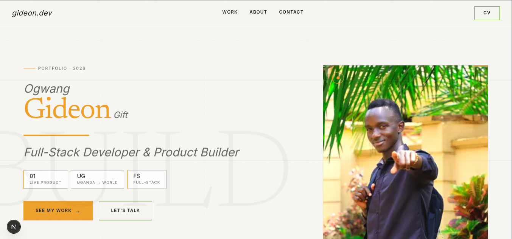

# Ogwang Gift Gideon — Portfolio

> A portfolio that makes you feel the builder before you read a word.

**Live:** [iamgideon.vercel.app](https://iamgideon.vercel.app/)



---

## What this is

Not a CV site. A live brand statement — engineered to communicate craft, technical depth, and personality the moment it loads. Every animation, interaction, and design decision is intentional.

Built with the kind of care that makes other developers look twice at the source code.

---

## Quick start

**Prerequisites:** Node.js 18+ and pnpm.

```bash
pnpm install
pnpm dev
```

Open [http://localhost:3000](http://localhost:3000).

```bash
# Production build
pnpm build
pnpm start
```

---

## Tech stack

| Layer | Technology |
|-------|-----------|
| Framework | Next.js (App Router) |
| Language | TypeScript — strict mode, zero `any` |
| Styling | Tailwind CSS v4 + CSS custom properties |
| Scroll | Lenis (smooth scroll, GSAP-synced) |
| Scroll Animations | GSAP + ScrollTrigger |
| Text Animations | GSAP SplitText |
| SVG Drawing | GSAP DrawSVG |
| Transitions | Framer Motion `AnimatePresence` |
| Package Manager | PNPM |
| Deployment | Vercel |

---

## Project structure

```
gideon-portfolio/
├── app/                        # Next.js App Router — pages & root layout
│   ├── layout.tsx              # Lenis, cursor, fonts, AnimatePresence root
│   ├── page.tsx                # Home — hero + featured projects
│   ├── projects/page.tsx
│   ├── about/page.tsx
│   └── contact/page.tsx
├── components/
│   ├── preloader/              # Cinematic loading sequence
│   ├── cursor/                 # Custom animated cursor (desktop only)
│   ├── nav/                    # Navbar with CV download
│   ├── hero/                   # Scroll-pinned hero sequence
│   ├── projects/               # Project cards and grid
│   └── shared/                 # SectionReveal, PageTransition
├── data/
│   ├── projects.ts             # All project content — edit here, not in JSX
│   └── stack.ts                # Tech stack categories
├── lib/
│   ├── lenis.ts                # Lenis singleton + GSAP ticker sync
│   └── gsap.ts                 # GSAP context + one-time plugin registration
├── public/
│   ├── images/                 # Photos, screenshots, project mockups
│   └── cv/                     # Downloadable CV PDF
└── styles/
    └── globals.css             # All design tokens live here
```

---

## How it's built

**Routing & rendering** — Next.js App Router with server components by default. `'use client'` added only where interactions or hooks demand it. Static generation where possible.

**Type safety** — TypeScript strict mode across the entire repo. Every component prop is typed. No `any`. No shortcuts.

**Design system** — Two accent colours with strict domain rules: amber owns identity and personal elements, electric green owns technical and builder elements. All values are CSS custom properties — no hardcoded hex anywhere in component code.

**Smooth scroll** — Lenis initialised as a singleton in `lib/lenis.ts`, synced with the GSAP ticker so scroll-driven animations stay frame-perfect.

**GSAP animations** — All scroll choreography runs through ScrollTrigger. The hero section is a pinned, scrubbed timeline. Text animations use SplitText for word-by-word reveals. SVG lines draw with DrawSVG. React integration uses the `useGSAP` hook pattern with `gsap.context()` for clean scoping and teardown — never `useEffect`.

**Page transitions** — Framer Motion's `AnimatePresence` wraps all route changes. Accent bar sweeps on exit, new page slides in on enter.

**Performance** — Animations stay on `transform` and `opacity`. `will-change` applied surgically. `next/image` for all images with proper `sizes` attributes. `prefers-reduced-motion` respected everywhere — fallbacks to simple opacity transitions.

---

## Conventions

- **pnpm only.** Never `npm install` or `yarn add` in this repo.
- **No `border-radius`** on any element except the cursor ring. Sharp corners are a design decision.
- **No `box-shadow`.** Depth comes from tonal shifts and hairline borders.
- **Project data in `data/projects.ts`.** Never hardcode content in JSX.
- **GSAP plugins registered once** in `lib/gsap.ts`. Never per-component.
- **`prefers-reduced-motion` always respected.** Every animation has a fallback.

---

## Adding or updating projects

Open `data/projects.ts` and edit the array. Cards, featured status, stack tags, and links are all driven from that file. No component markup changes needed.

---

## Screenshots


---

## Contact

| | |
|-|-|
| GitHub | [github.com/Gito125](https://github.com/Gito125) |
| LinkedIn | [linkedin.com/in/iamgideon125](https://www.linkedin.com/in/iamgideon125) |
| X | [x.com/OgwangGift](https://x.com/OgwangGift) |
| Email | [iamgideon125@gmail.com](mailto:iamgideon125@gmail.com) |

---

## License

The **code** in this repository is MIT licensed — use it, learn from it, build on it.

The **content** — name, photos, biography, and project descriptions — belongs to Ogwang Gift Gideon and is not licensed for reuse. See [LICENSE](LICENSE) for the full terms.

---

*Built with intention. Deployed with confidence.*